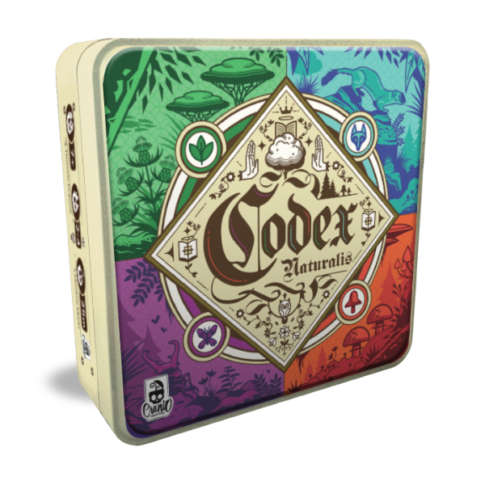

# IS24-LB09 - Codex Naturalis

### The Team

* Matrundola Tony David - tonydavid.matrundola@mail.polimi.it
* Festa Riccardo - riccardo2.festa@mail.polimi.it
* Cepi Giuseppepìo - giuseppepio.cepi@mail.polimi.it
* Altomari Giulio Giovanni - giuliogiovanni.altomari@mail.polimi.it

## About

### Implemented Functionalities
<table>
<tr><td>

| Functionality     |  Status    |
|:------------------|:----------:|
| Basic Rules       | :warning:  |
| Complete Rules    | :warning:  |
| Socket            | :warning:  |
| CLI               | :warning:  |
| GUI               | :warning:  |

</td><td>

| Advanced Functionality  |   Status   |
|:------------------------|:----------:|
| Persistence             | :warning:  |
| Multiple games          | :warning:  |
| Resilience              | :warning:  |
| Chat                    | :warning:  |

</td></tr>
</table>

### Tabella Voto
<table>

| Requisiti                                       |Voto Massimo|Realizzazione|
|:------------------------------------------------|:----------:|:-----------:|
| Regole semplificate + comunicazione + CLI       |     18     |  :warning:  |
| Regole complete + comunicazione + CLI           |     21     |  :warning:  |
| Regole complete + comunicazione + GUI           |     24     |  :warning:  |
| Regole complete + comunicazione + GUI +1FA      |     27     |  :warning:  |
| Regole complete + comunicazione + CLI + GUI +1FA| 30 / 30L   |  :warning:  |

  
</table>

##### Legend
:x: Not Implemented &nbsp;&nbsp;:warning: Implementing &nbsp;&nbsp;:white_check_mark: Implemented

## Tools
| Tool                                                     | Description           |
|:---------------------------------------------------------|:----------------------|
| [LUCID](https://lucid.app)                               | UML                   |
| [IntelliJ IDEA Ultimate](https://www.jetbrains.com/idea) | IDE                   |
| [Maven](https://maven.apache.org)                        | Dependency Management |
| [JavaFX](https://openjfx.io)                             | Graphical Library     |
| [JUnit](https://junit.org/junit5)                        | Unit Testing          |

# Jar

_To be completed_

## License
[**Codex Naturalis**](https://www.craniocreations.it/prodotto/codex-naturalis) is property of [_Cranio Creations_] and all of the copyrighted graphical assets used in this project were supplied by [**Politecnico di Milano**] in collaboration with their rights' holders.

[_Cranio Creations_]: https://www.craniocreations.it/
[**Politecnico di Milano**]: https://www.polimi.it/
